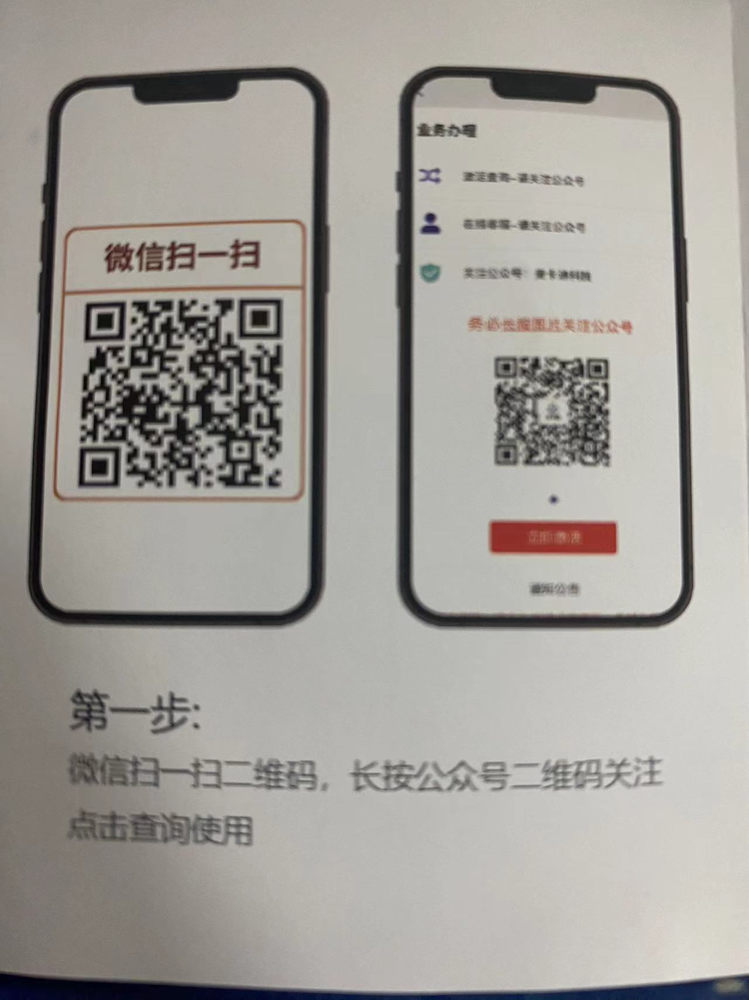
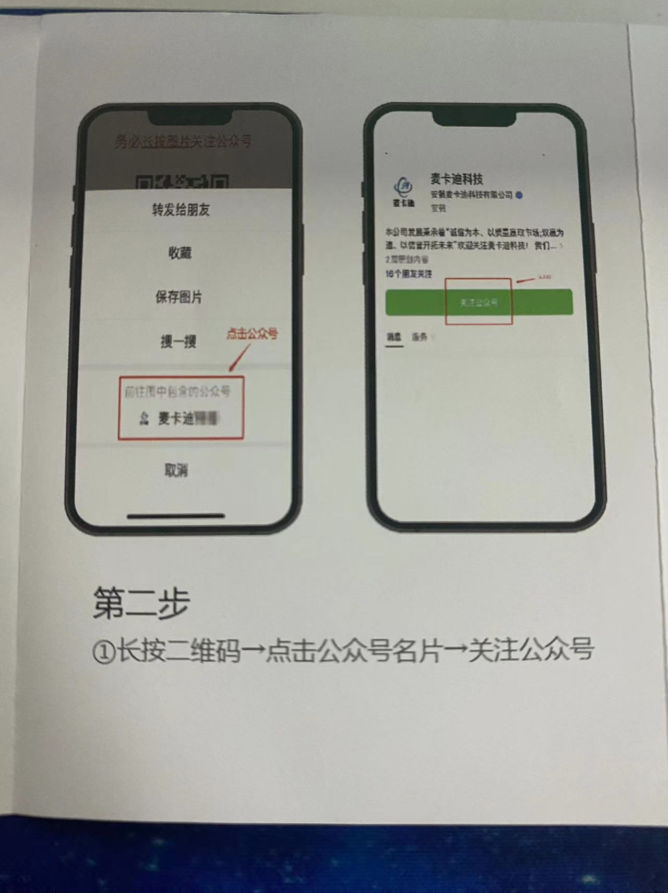
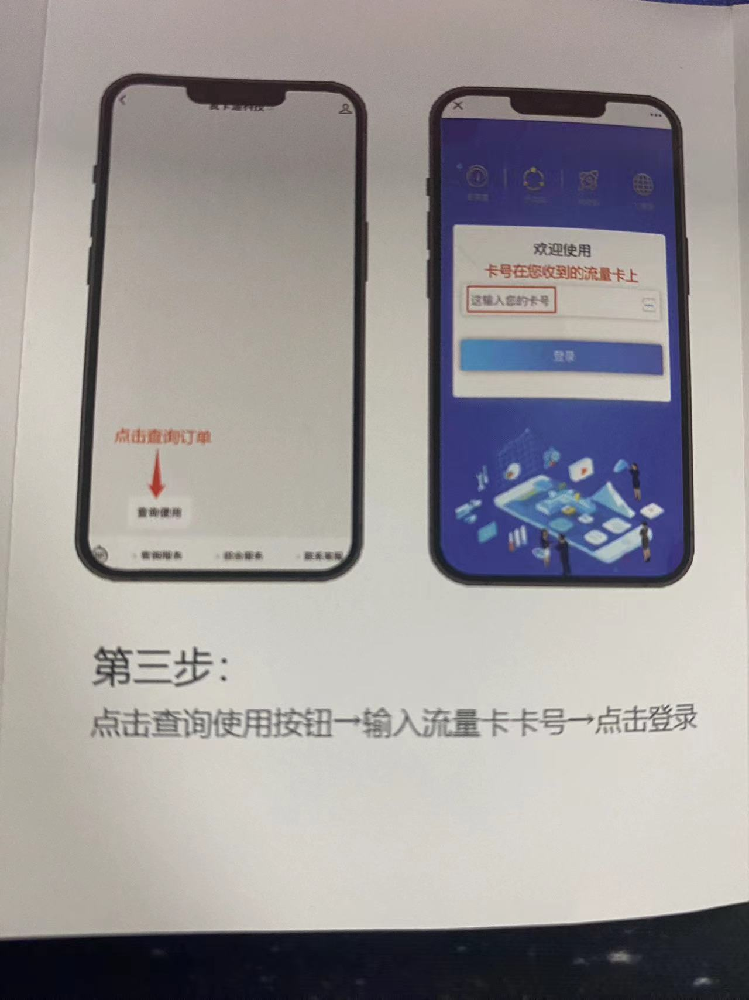
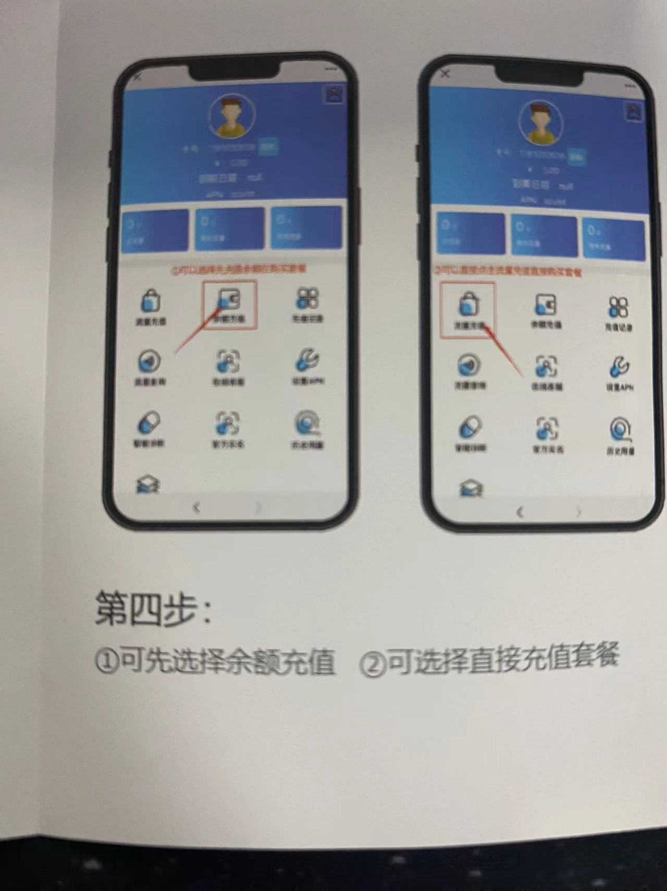
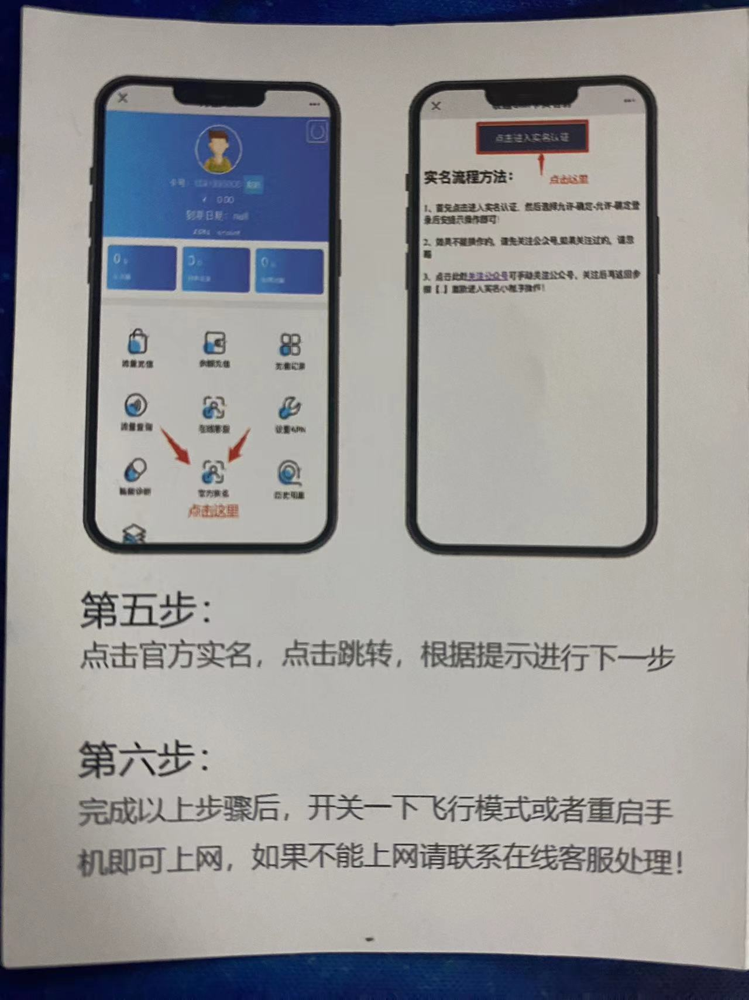

# 流量卡帮助中心

## 流量卡使用说明

第一步： 微信扫一扫二维码，长按公众号二维码关注点击查询使用

<figure><figcaption></figcaption></figure>

第二步：长按二维码-点击公众号名片-关注公众号

<figure><figcaption></figcaption></figure>

第三步：点击查询使用按钮-输入流量卡卡号点击登录

<figure><figcaption></figcaption></figure>

第四步：先选择余额充值-在选择充值套餐

<figure><figcaption></figcaption></figure>

第五步：点击官方实名，点击跳转，根据提示进行下一步

<figure><figcaption></figcaption></figure>

第六步：完成以上步骤，开关一下飞行模式或者重启手机即可上网，如果不能上网请联系在线客服处理

找不到问题的解决办法请联系客服或者发送邮件到：：740762356@qq.com
