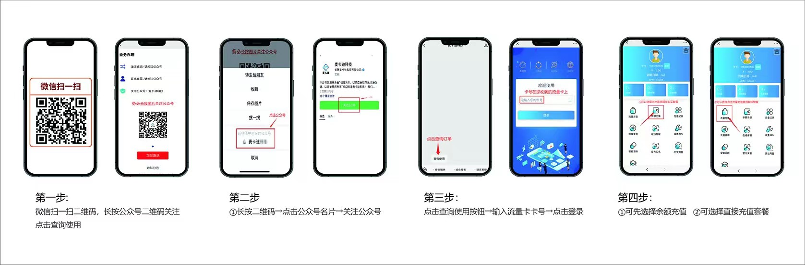
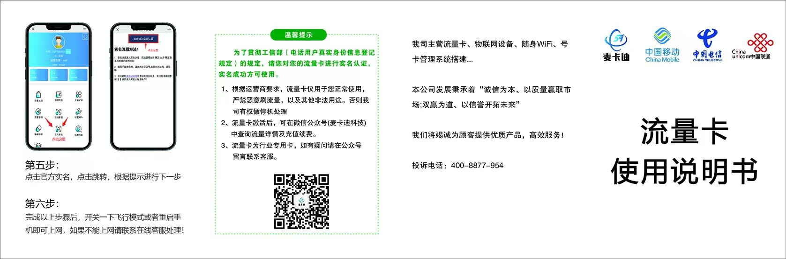

# 流量卡帮助中心

## 流量卡充值使用说明

<figure><figcaption></figcaption></figure>

<figure><figcaption></figcaption></figure>

完成以上步骤，开关一下飞行模式或者重启手机即可上网，如果不能上网请设置相关：[**APN**](qa/3.md)

找不到问题的解决办法请联系客服或者发送邮件到：：740762356@qq.com
