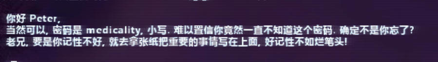
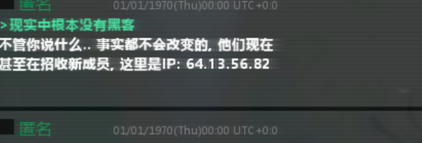
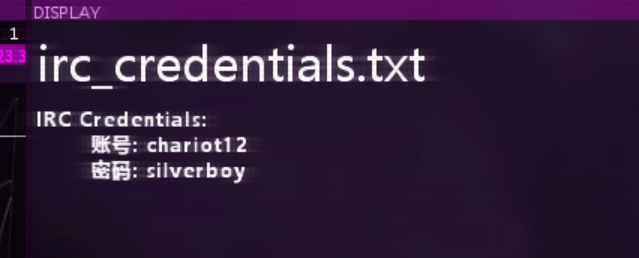
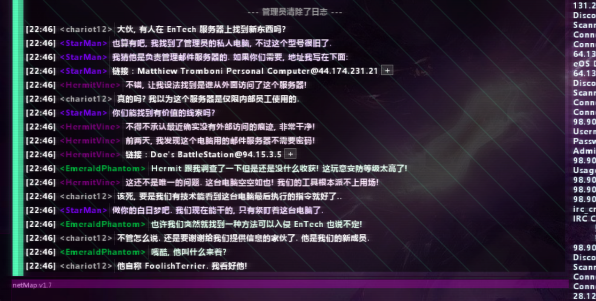
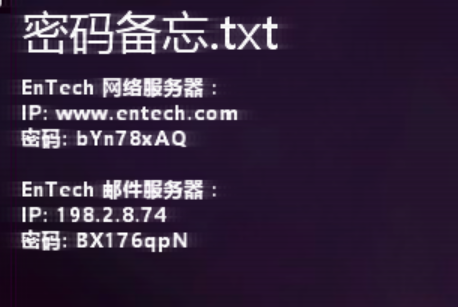
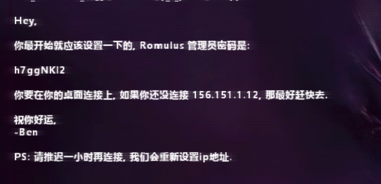

# Hacknet HeartBeat 游戏线索

游戏线索

1、链接死亡服务器的主节点密码

2、玩家的起搏器

3、好像有人进入过这个起搏器（卧槽我在里面发现了测试固件，估计是被人搞死的）

4、链接IP的Email备份信息

5、备份提到的IP有三个IP

一、进不去CSEC

二、可以进去

三、

6、eosScanner

7、招聘服务器有人删文件

8、eosSanner上scan会得到一个Toy Server集群，其中IRC密码：

9、上面IRC论坛的消息

10、私人电脑上的密码

Conn

